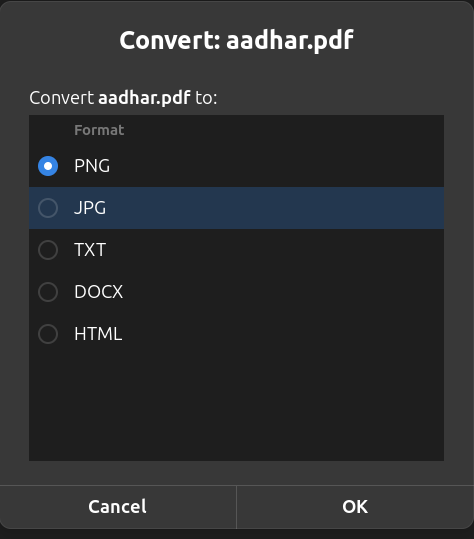

# fileconv

local file converter. right-click any file in nautilus → Scripts → Convert File.
no browser, no upload, no waiting.



---

## what it does

converts between common file formats entirely on your machine using tools you probably already have.

**supported formats:**

| input | output options |
|-------|---------------|
| images (png, jpg, webp, bmp, gif, tiff) | pdf |
| pdf | png, jpg, txt, docx, html |
| docx | pdf, txt, md |
| pptx / ppt | pdf, png, txt |
| markdown | pdf, html, docx |
| html | pdf, md, docx, txt |
| txt | pdf, html, md |

also: merge multiple files into one pdf, split a pdf into individual pages.

---

## install

**dependencies:**

```bash
# apt
sudo apt install imagemagick img2pdf wkhtmltopdf pandoc poppler-utils libreoffice

# pip
pip install pypdf pdf2docx --break-system-packages
```

**install conv + nautilus scripts:**

```bash
git clone https://github.com/yourusername/fileconv
cd fileconv
chmod +x install.sh
./install.sh
```

restart nautilus if scripts don't appear:

```bash
nautilus -q; nautilus &
```

---

## cli usage

```bash
conv photo.png                        # → photo.pdf
conv report.docx report.pdf           # explicit output
conv scan.pdf scan.txt                # pdf → text
conv scan.pdf page.png                # pdf → images
conv *.jpg combined.pdf               # multiple images → one pdf
conv merge final.pdf a.pdf b.pdf      # merge pdfs
conv split big.pdf                    # split into pages
```

if you skip the output filename, conv picks a sensible default based on input type.

---

## gui (nautilus)

after install, right-click any supported file:

- **Convert File** — picks up the file extension, shows valid target formats, converts
- **Merge to PDF** — select 2+ files, right-click → merges into one pdf

---

## how it works

conv is a thin routing layer over existing tools — no reinventing the wheel:

| task | tool |
|------|------|
| images → pdf | img2pdf (lossless) |
| pdf → images | imagemagick |
| pdf → text | pdftotext (poppler) |
| pdf → docx | pdf2docx |
| docx/pptx → pdf | libreoffice headless |
| html → pdf | wkhtmltopdf |
| md/html/docx conversions | pandoc |
| merge/split pdf | pypdf |

---

## notes

- **pdf → docx** will never be perfect. pdf stores text as absolute coordinates, not semantic structure. the output will have the content but formatting may be off. this is a pdf problem, not a bug.
- tested on ubuntu 24.04 + gnome nautilus 46.

---

## license

mit
